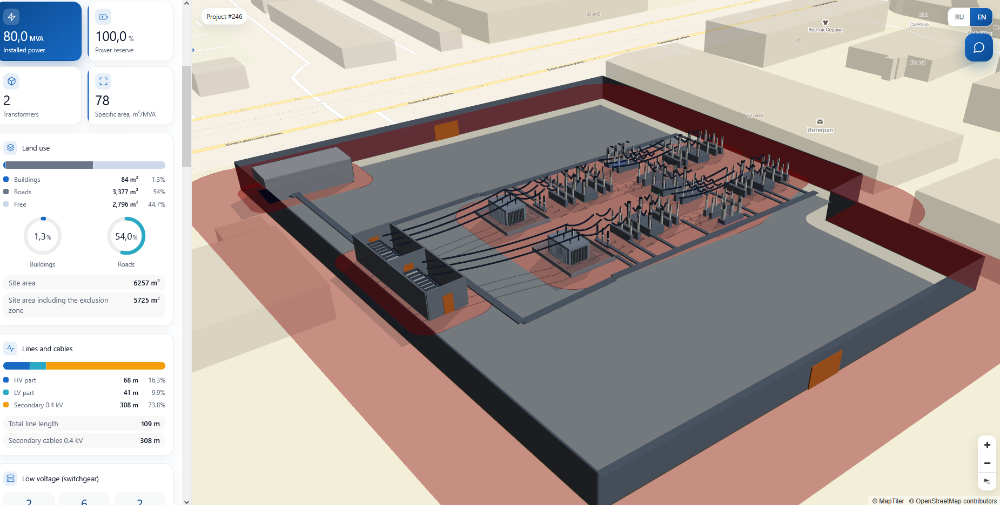
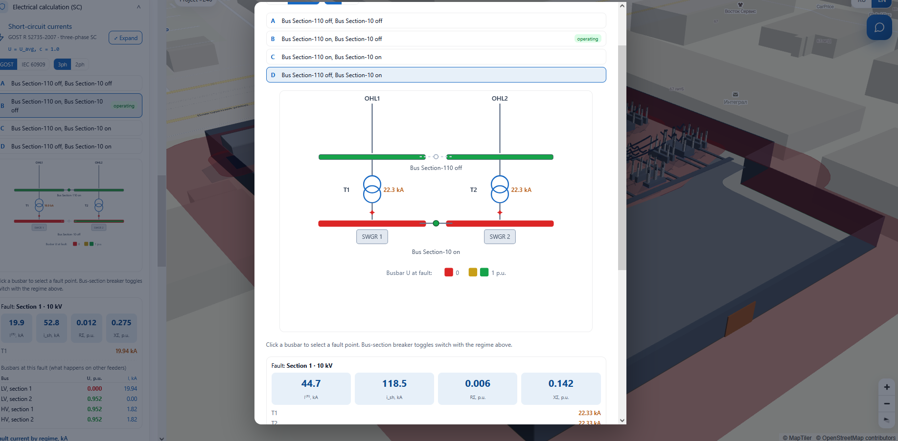
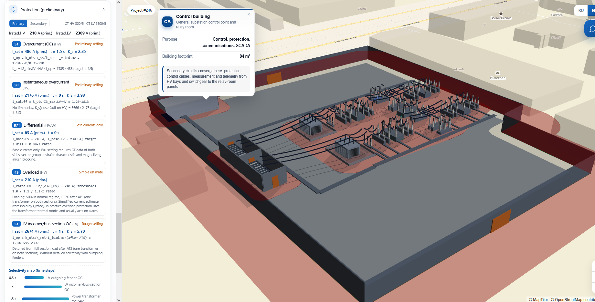
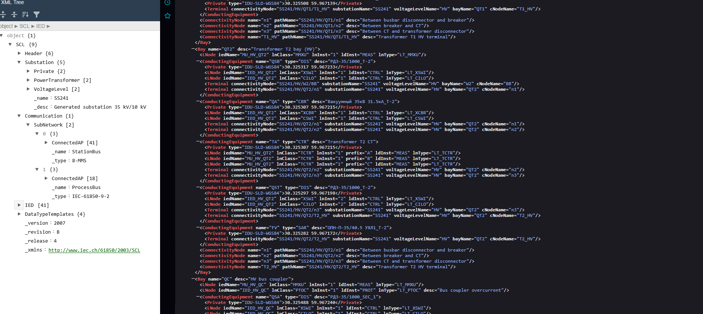
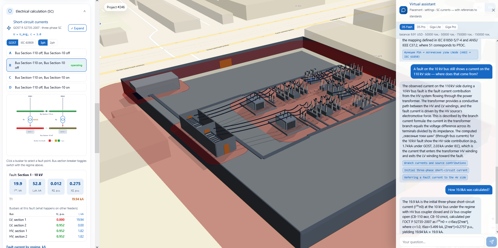
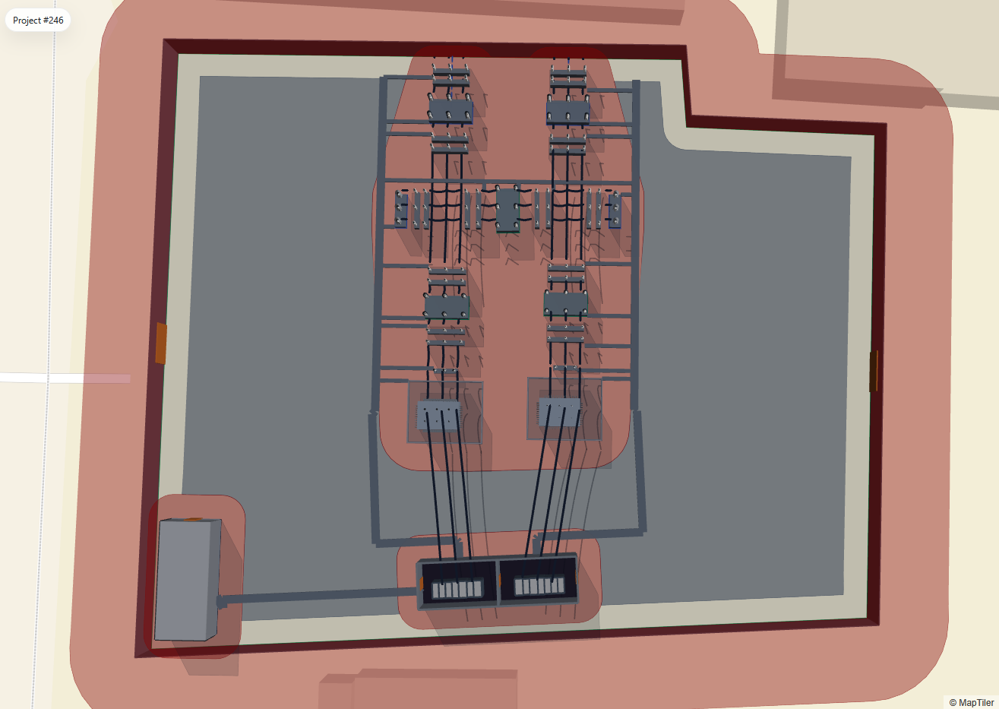
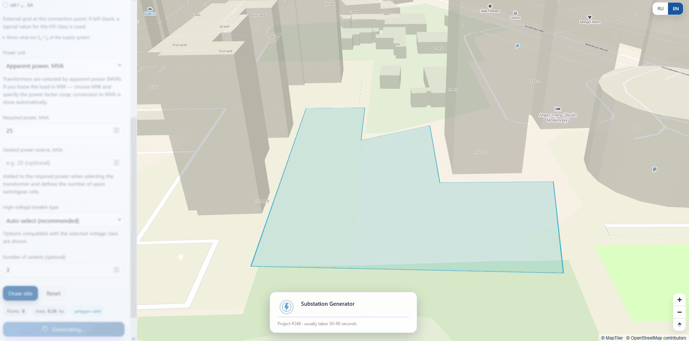

# Substation Design Generator

An automated design tool for HV distribution substations. It generates a
code-compliant physical layout on a real-world map in 3D, runs a multi-regime
short-circuit and protection-setting analysis, and exports the whole design as
**IEC 61850 SCL** (SSD/SCD).

> **Note on the source code.** The generator is a private project. This repository
> is a portfolio showcase — screenshots, recordings and an architecture write-up.


---

## What it does

Give it a plot of land (drawn on a real map) and a set of parameters — voltage
classes, installed power, incoming-line configuration and number of variants — 
and it produces a preliminary substation concept with automatically placed equipment:

1. **A physical layout** — transformers, HV breaker bays, section switchgear,
   metal-clad switchgear (KRUN/КРУН), the control building (OPU/ОПУ), busbars,
   protective zones, roads and cable channels — placed automatically according to
   Russian **PUE / GOST** clearance and layout rules, and rendered in 3D over the
   actual terrain.
2. **An electrical analysis** — bus impedance matrix (Z-bus), short-circuit currents
   across every switching regime, to both **GOST R 52735** and **IEC 60909**.
3. **Preliminary protection settings** — ANSI 50 / 51 / 87T / 49, selectivity
   staging, and automatic CT ratio selection.
4. **Interoperable export** — an **IEC 61850-6 SSD/SCD** file that validates against
   the official SCL schema.
5. **A norms assistant** — an LLM copilot that explains why every number came out
   the way it did, citing the relevant standard — while never doing the math itself.

---

## Highlights

| | |
|---|---|
| Automated 3D layout on a real map, following PUE/GOST placement rules |  |
| Multi-regime short-circuit analysis (Z-bus, GOST R 52735 + IEC 60909, 3φ/2φ) |  |
| Preliminary protection settings (ANSI 50/51/87T/49, selectivity, CT selection) |  |
| IEC 61850 SCL export (SSD/SCD, XSD-validated) |  |
| AI norms copilot that explains the calculations against the standards |  |

---

## Feature deep-dives

### Automated physical layout generation

The core is a geometric layout engine. It places every piece of primary
equipment on the plot so that the result respects electrical clearances, fire
gaps, road access and the fence setback mandated by PUE/SP. Layout candidates
are searched, scored and the winner is assembled with full detail.

- Real geodata throughout (**WGS84**), rendered in 3D with MapLibre GL
  `fill-extrusion` primitives + deck.gl for the phase conductors.
- Topological invariants are enforced: line **W1G → HV section 1 → T-1 → LV busbar 1c**,
  line **W2G → HV section 2 → T-2 → LV busbar 2c**; at most two transformers.



### Live generation trace

Instead of a spinner, the search imitates realtime equipment placement: rejected layout
candidates flash red, the accepted core turns green, and the winner is then built
up stage by stage (core → conductors → cable channels → control building) in full 3D.



### Short-circuit analysis (GOST R 52735 + IEC 60909)

A dedicated electrical layer is assembled from the generated layout: a network of
per-unit impedances (source system → HV → transformers → MV), solved via the
bus impedance matrix (Z-bus = Y-bus⁻¹).

- Every switching regime (section breakers open/closed combinations A/B/C/D)
  is solved, with a worst-case aggregation per bus.
- Two standards side by side — **GOST R 52735-2007** (U = U_avg, c = 1.0) and
  **IEC 60909** (U = U_nom, c_max = 1.10, with the transformer impedance
  correction factor Kt) — switchable in the UI.
- Three-phase and two-phase faults, impulse current i_p, κ factor, X/R,
  fault-point bus voltages and branch contributions.
- Bus-by-bus interactive single-line diagram: click a bus to fault it.


### Preliminary protection settings

From the fault currents, the tool proposes settings for the main transformer
protections and checks selectivity:

- **ANSI 51 (IDMT overcurrent), 50 (instantaneous), 87T (differential),
  49 (thermal)**, plus the LV incomer.
- Settings are de-rated by the maximum-current regime and their sensitivity
  is checked against the minimum-current regime — the two extremes are computed
  separately.
- Automatic **CT ratio selection** (nearest IEC standard ratio ≥ 1.05 × I_nom),
  with a primary/secondary values toggle for the relay engineer.
- Each setting carries its formula with the numbers substituted in. This tool is explicit that these
  are preliminary values, not commissioning settings.


### Secondary cable-channel routing

The secondary cabling is routed automatically: a comb pattern inside
each equipment security zone, and an orthogonal A* router outside it that goes around the primary equipment to reach
the switchgear and the control building.

### IEC 61850 SCL export (SSD / SCD)

The design exports to **IEC 61850-6** — both a System Specification Description
(SSD) and a Substation Configuration Description (SCD):

- Primary equipment → conducting equipment (CBR/DIS/CTR/VTR/SAR/IFL/PTR).
- ANSI functions → logical nodes (51→PTOC, 50→PIOC, 87→PDIF, 49→PTTR, …), with
  per-phase CT/VT modelling, one controller IED and one merging unit IED per bay,
  GOOSE interlocking, SMV subscriptions and a populated `DataTypeTemplates`.
- Every export is validated against the official SCL XSD in the test suite.

The SCL model is a hand-written, focused JAXB model rather than a full
XJC-generated one — small, readable, and complete enough to produce
schema-valid files.


### AI norms copilot

A floating assistant explains the design decisions and the derivation of every
short-circuit / protection value, citing the relevant clause of the standard.

- Hard invariant: the LLM never computes. All numbers come from the
  deterministic engine; the model only unfolds the derivation, substitutes the
  already-computed values and points at the norm.
- The norms corpus is small, so it's fed to the model as full context.
- Offline functioning: any network failure degrades to a warning; the rest of
  the app keeps working.


---

## Architecture

```
┌─────────────────────────────────────────────────────────────────┐
│  Frontend — Vue 2.7 (Composition API / <script setup>)          │
│  MapLibre GL 3.6 (3D fill-extrusion) + deck.gl (phase wires)    │
│  Corporate energy-dashboard UI · custom RU/EN i18n              │
└───────────────┬─────────────────────────────────────────────────┘
                │  REST (/api/v1)
┌───────────────┴───────────────────────────────────────────────────┐
│  Backend — Kotlin / Java · Spring Boot                            │
│                                                                   │
│   Geometric layout engine ──► generation result (WGS84 geometry)  │
│                    │                                              │
│                    ├─► Electrical layer  (Z-bus, GOST + IEC 60909)│
│                    ├─► Protection settings (ANSI 50/51/87T/49)    │
│                    ├─► Cable-channel router (comb + orthogonal A*)│
│                    ├─► SCL export (IEC 61850-6 SSD/SCD, JAXB)     │
│                    └─► Norms copilot (LLM, full-context, no math) │
│                                                                   │
│   MariaDB · Flyway migrations · JTS geometry                      │
└───────────────────────────────────────────────────────────────────┘
```

A more detailed write-up of the engineering decisions is in
[`docs/architecture.md`](docs/architecture.md).

---

## Tech stack

| Layer | Technology                                                                  |
|---|-----------------------------------------------------------------------------|
| **Backend** | Kotlin / Java, Spring Boot, Gradle                                          |
| **Persistence** | MariaDB, Flyway migrations                                                  |
| **Geometry** | JTS Topology Suite (per-unit UTM math, A\* routing, convex hulls)           |
| **Electrical** | Custom Z-bus solver (complex matrix inversion), GOST R 52735 + IEC 60909    |
| **Interop** | JAXB → IEC 61850-6 SCL, validated against the official XSD                  |
| **Frontend** | Vue 2.7, MapLibre GL 3.6, deck.gl, MapTiler basemap                         |
| **AI** | DeepSeek / GigaChat via a provider-routing layer, full-context norms corpus |
| **i18n** | Custom lightweight reactive RU/EN localization                              |

---

## Status

This is an ongoing personal project, built to explore substation design automation
and grid-software engineering (protection, short-circuit, IEC 61850).

